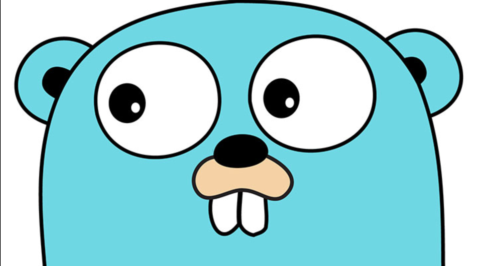

# Объявление переменных

```go
// краткое объявление переменной (наиболее компактное)
// может использоваться только внутри функции,
// но не для переменных уровня пакета
s := ""
```

```go
// инициализация по умолчанию
// для строки — значением ""
var s string
```

```go
// используется редко
// в основном при объявлении несколь­ких переменных
var s = ""
```

```go
// содержит явное указание типа перемен­ной
// является излишним, когда тип совпадает с типом начального значения переменной,
// но является обязательным в других случаях, когда типы пере­менной и инициализатора разные
var s string = ""
```

На практике обычно следует использовать одну из первых двух разновидностей:
- с явной инициализацией (чтобы указать важность начального значения);
- с неявной инициализацией по умолчанию (чтобы указать, что начальное значение не играет роли).

# Цикл `for`
Цикл `for` является единственной инструкцией цикла в Go. Он имеет ряд разно­видностей.

```go
// Традиционный цикл `for`
for инициализация; условие; последействие {
    // нуль или несколько инструкций
}
```

```go
// Традиционный цикл `while`
for condition {
    // ...
}
```

```go
// Традиционный бесконечный цикл
for {
    // ...
}
```

Бесконечный цикл, должен завершиться некоторым иным пу­тем, например с помощью инструкции `break` или `return`.

Разновидность цикла `for` выполняет итерации для диапазона значений для типа данных наподобие *строки* или *среза*.

```go
for i, arg := range someSlice {
    // ...
}
```
Если мы не нуждаемся в индексе, то его можно заменить на *пустой идентификатор* (blank identifier) с именем `_` (символ подчеркивания). Пустой идентификатор может использоваться вез­де, где синтаксис требует имя переменной, но логике программы он не нужен.

```go
for _, arg := range someSlice {
    // ...
}
```

# `if` с краткой инструкцией
Так же как и `for`, оператор `if` может начинаться с инструкции, которая будет выполнена перед проверкой условия.

Переменные объявленные в этом блоке доступны только в области видимости, которая существует до конца `if`.

Переменные объявленные внутри краткой инструкции if также доступны внутри всех else блоков.

(Попробуйте использовать `v` в последнем операторе `return`.)
```go
func pow(x, n, lim float64) float64 {
    if v := math.Pow(x, n); v < lim {
        return v
    } else {
        fmt.Printf("%g >= %g\n", v, lim)
    }
    // can't use v here, though
    return lim
}
```


# `switch`
Вероятно вы уже догадались, на что будет похож `switch`.

Блок case прерывается автоматически, только если он не заканчивается оператором `fallthrough`.

```go
package main

import "fmt"

func main() {
    // инициализируем внутри переменную `switch`
    // `swichCondition` существует только в рамках данного `switch` ???
    switch swichCondition := 2; swichCondition {
    case 1:
        fmt.Println("Case 1")
    case 2:
        // выполнит принт согласно условию `swichCondition`
        fmt.Println("Case 2")
        // продолжит проверять последующие условия из-за `fallthrough`
        fallthrough
    default:
        fmt.Printf("Case default")
    }
}

```


# `switch` без условия
`switch` без условия это тоже самое, что и `switch true`.

Эта конструкция может быть использована как более ясный способ записи длинной цепочки `if-then-else`.

```go
package main

import (
    "fmt"
    "time"
)

func main() {
    t := time.Now()
    switch {
    case t.Hour() < 12:
        fmt.Println("Good morning!")
    case t.Hour() < 17:
        fmt.Println("Good afternoon.")
    default:
        fmt.Println("Good evening.")
    }
}
```


# Размер и вместимость среза
Срез имеет размер (длину) и вместимость.

Размер среза - это количество элементов, которые он содержит.

Вместимость среза - это количество элементов в его нижележащем массиве, начиная с первого элемента в срезе.

Размер и вместимость среза `s` могут быть получены с помощью `len(s)` и `cap(s)`.

Размер среза может быть увеличен путем повторной операции "срезания", при условии, что он обладает достаточной вместимостью. 

__*Срезы по верхней границей не меняют вместимость исходного среза. Срезы по нижней границе изменяют исходный срез, уменьшая его вместимость.*__

```go

import "fmt"

func main() {
    s := []int{2, 3, 5, 7, 11, 13}
    printSlice(s)

    // Slice the slice to give it zero length.
    s = s[:0]
    printSlice(s)

    // Extend its length.
    s = s[:4]
    printSlice(s)
    
    // Вернем срез к исходному состоянию
    s = s[:6]
    printSlice(s)

    // Drop its first two values.
    // После этой операции вместимость среза `s` уменьшится.
    // Два первых элемента будут удалены из среза
    s = s[2:]
    printSlice(s)
    
    // Будет удален еще один элемент
    // Из-за среза по нижней границе
    s = s[1:3]
    printSlice(s)
    
}

func printSlice(s []int) {
    fmt.Printf("len=%d cap=%d %v\n", len(s), cap(s), s)
}
```

```
Output:
len=6 cap=6 [2 3 5 7 11 13]
len=0 cap=6 []
len=4 cap=6 [2 3 5 7]
len=6 cap=6 [2 3 5 7 11 13]
len=4 cap=4 [5 7 11 13]
len=2 cap=3 [7 11]
```

# Указатели на структуры
Доступ к полям структуры может быть получен через указатель на структуру.

Чтобы получить поле X структуры, когда у нас есть указатель на структуру p, мы можем написать:
- `(*p).X`
- `p.X` (без явного разыменования)

```go
package main

import "fmt"

type Vertex struct {
    X int
    Y int
}

func main() {
    v := Vertex{1, 2}
    p := &v
    p.X = 1e9
    fmt.Println(v) // {1000000000 2}
}
```